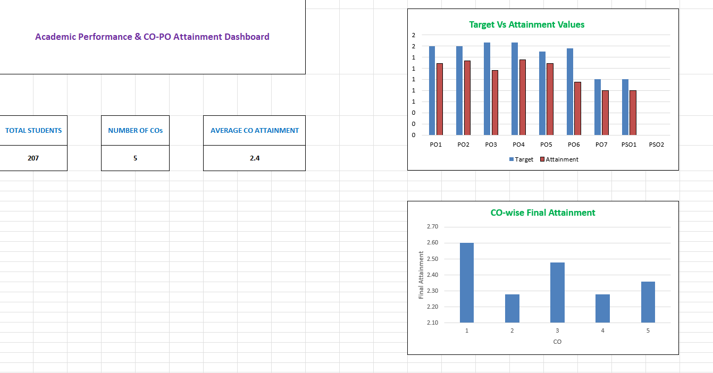
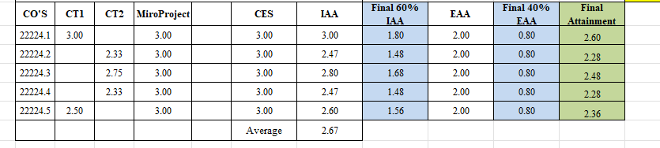
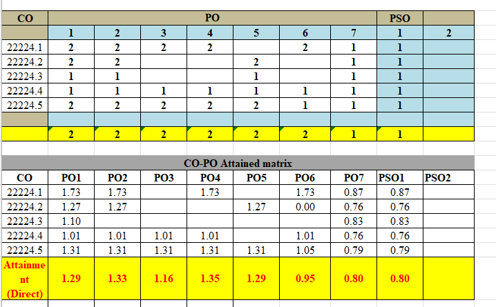
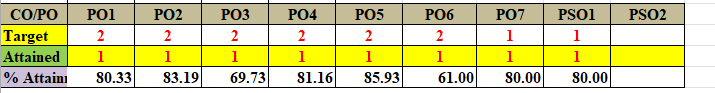

# Academic Performance & CO-PO Attainment Analysis Using Excel

## Project Overview

This project demonstrates an Excel-based approach to analyzing academic assessment data and evaluating Course Outcome (CO) attainment.

The project covers assessment data validation, CO attainment calculation, CO-PO/PSO mapping, target-versus-attainment analysis, reporting, and dashboard visualization.

## Objective

The objective of this project is to analyze academic assessment data and calculate course outcome attainment to support academic monitoring and continuous improvement.

## Analytical Problem

Academic assessment data is collected across multiple assessment components and needs to be organized, validated, analyzed, and converted into meaningful performance indicators.

This project demonstrates how Microsoft Excel can be used to transform assessment data into structured CO attainment metrics, CO-PO/PSO mapping analysis, target-versus-attainment comparisons, observations, and dashboard reporting.

## Tools Used

* Microsoft Excel
* Excel Formulas
* Data Validation
* Data Cleaning
* Data Aggregation
* KPI Analysis
* Data Visualization
* Dashboard Development
* Reporting

## Project Workflow

1. Organized academic assessment data.
2. Validated assessment and input data.
3. Mapped assessment components to Course Outcomes (COs).
4. Applied assessment targets and thresholds.
5. Calculated CO-wise attainment.
6. Performed CO-PO/PSO mapping.
7. Compared target and actual attainment.
8. Analyzed observations and action-taken requirements.
9. Consolidated key performance indicators into an Excel dashboard.
10. Presented results through charts and visual reporting.

## Key Analysis

* Assessment data analysis
* Data validation
* CO attainment calculation
* CO-PO/PSO mapping
* Target vs actual attainment
* Internal and external assessment analysis
* KPI analysis
* Dashboard reporting
* Observation and action-taken analysis

## Dashboard Preview

## CO Attainment Analysis

## CO-PO/PSO Mapping

## Target vs Attainment

## Key Insights

* Assessment data was consolidated across multiple evaluation components.
* CO-wise attainment was calculated using defined assessment targets and attainment measures.
* CO-PO/PSO mapping was used to connect course-level outcomes with program-level outcomes.
* Target-versus-attainment analysis was used to identify performance gaps.
* Dashboard reporting provided a consolidated view of academic performance indicators.
* Observation and action-taken analysis supported continuous improvement activities.

## Skills Demonstrated

* Microsoft Excel
* Data Cleaning
* Data Validation
* Data Analysis
* Data Aggregation
* KPI Analysis
* Data Visualization
* Dashboard Development
* Reporting
* Outcome Attainment Analysis
* Analytical Problem Solving

## Data Privacy

The public portfolio version uses anonymized, aggregated, or synthetically recreated data.

No personally identifiable student information should be included in the public repository.

## Project File

The main project workbook is:

`Academic_Performance_CO_PO_Attainment_Analysis.xlsx`

## Author

Swati Sanjay Patil

Data Analyst | SQL | Python | Power BI | Excel | Business Operations
